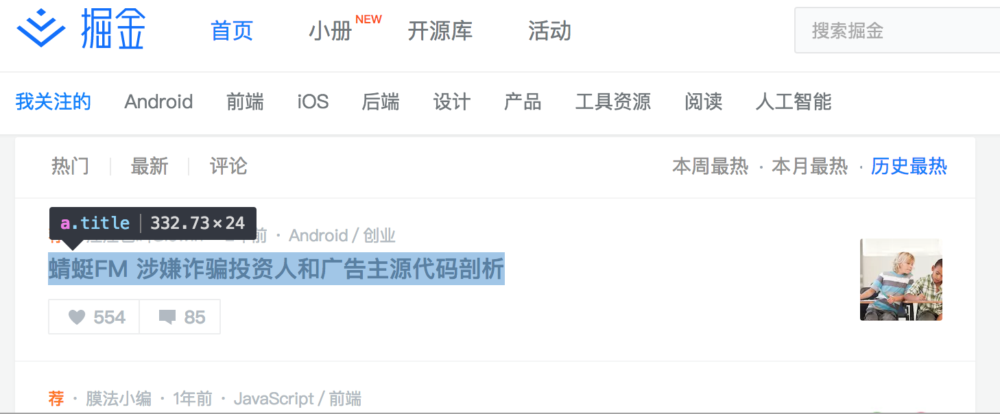
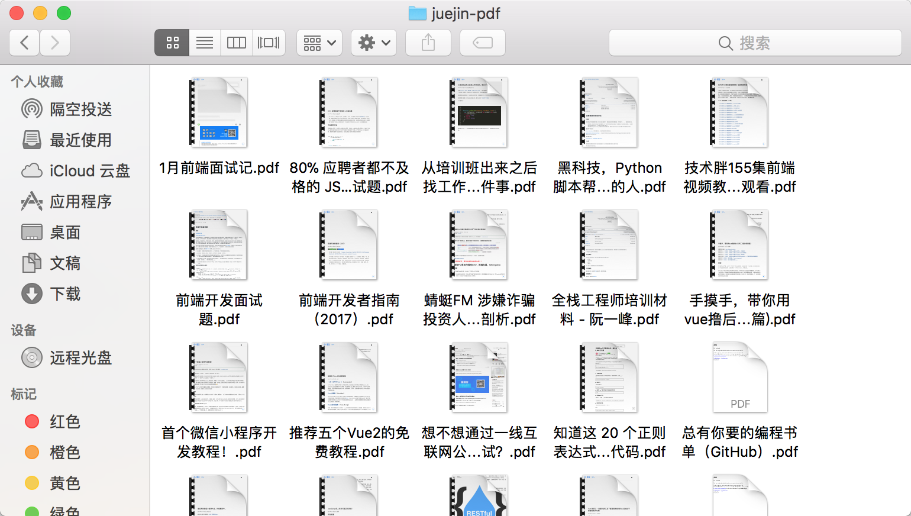

[Puppeteer](https://github.com/GoogleChrome/puppeteer)是一个Node库，通过[DevTools Protocol](https://github.com/ChromeDevTools/awesome-chrome-devtools#readme)提供高级API来控制[Headless Chrome](https://developers.google.com/web/updates/2017/04/headless-chrome)，大部分在浏览器中手动完成的事情都可以通过Puppeteer完成，以下是几个例子：

+ 打印页面：可以生成页面的screenshots和PDF
+ 高级爬虫：可以抓取SPA页面和预渲染(SSR)页面
+ 自动化测试：自动表单提交，UI测试，键盘输入等
+ 性能分析：利用chrome的timeline以帮助诊断性能问题

## 准备工作
创建一个新文件夹，并安装puppeteer（要求Node版本为6.4.0以上，使用async/await语法要求Node版本为7.6.0以上）
``` bash
$ npm init
$ npm i --save puppeteer
```
## 生成截图
先从最简单的screenshots开始，由于puppeteer要求必须有相应的匹配路径，所以必须先创建相应的文件夹

<!-- more -->
```bash
$ mkdir screenshots
$ mkdir src
$ cd src
```
在src路径下创建index.js，并编辑以下代码
```javascript
const puppeteer = require('puppeteer');

(async () => {
    const browser = await puppeteer.launch();
    const page = await browser.newPage();
    await page.goto('https://cn.bing.com/');
    await page.screenshot({ path: '../screenshots/bing.png' });

    await browser.close();
})();
```
然后使用node执行,就可以在screenshots目录下得到bing.png的截图
```bash
$ node index.js
```


使用puppeteer.launch({ headless: false })进入non-headless模式（可视化调试），可以清晰的看到每一步骤的实现
```javascript
const browser = await puppeteer.launch({ headless: false });
```
使用page.setViewport()调整页面大小,得到更好的截图效果
```javascript
page.setViewport({ width: 1440, height: 900 });
```


## 自动登录
以登录[掘金](https://juejin.im/)为例，首先在src路径下创建cred.js，用来存储账号、密码（此处为测试账号）
```javascript
module.exports = {
    username: 'sydot12345@gmail.com',
    password: '12345sydot'
};
```
自动输入账号、密码要通过css selector来获取对应的元素


在这里要获取到的元素包括：1、登录按钮 2、账号输入框 3、密码输入框 4、登录按钮


获得的选择器如下：
```javascript
const LOGIN_SELECTOR = '#juejin > div.view-container > div > header > div > nav > ul > li.nav-item.auth > span.login';
const USERNAME_SELECTOR = '#juejin > div.global-component-box > div.auth-modal-box > form > div.panel > div.input-group > div:nth-child(1) > input';
const PASSWORD_SELECTOR = '#juejin > div.global-component-box > div.auth-modal-box > form > div.panel > div.input-group > div:nth-child(2) > input';
const BUTTON_SELECTOR = '#juejin > div.global-component-box > div.auth-modal-box > form > div.panel > button';
```
使用page.click(selector, clickOptions)来点击元素,使用page.keyboard.type()来模拟键盘的输入。
```javascript
const puppeteer = require('puppeteer');
const CREDS = require('./creds');

const LOGIN_SELECTOR = '#juejin > div.view-container > div > header > div > nav > ul > li.nav-item.auth > span.login';
const USERNAME_SELECTOR = '#juejin > div.global-component-box > div.auth-modal-box > form > div.panel > div.input-group > div:nth-child(1) > input';
const PASSWORD_SELECTOR = '#juejin > div.global-component-box > div.auth-modal-box > form > div.panel > div.input-group > div:nth-child(2) > input';
const BUTTON_SELECTOR = '#juejin > div.global-component-box > div.auth-modal-box > form > div.panel > button';
(async () => {
    const browser = await puppeteer.launch({ headless: false });
    let page = await browser.newPage();
    await page.goto('https://juejin.im/');
    await page.waitFor(2*1000);

    await page.click(LOGIN_SELECTOR);

    await page.click(USERNAME_SELECTOR);
    await page.keyboard.type(CREDS.username);
    
    await page.click(PASSWORD_SELECTOR);
    await page.keyboard.type(CREDS.password);
    
    await page.click(BUTTON_SELECTOR);
    await page.waitFor(2*1000);

    await browser.close();
})();
```
以下是获得的效果，可以实现自动登录。


## 生成PDF
使用上面已经登录好的账号来爬取历史最热文章的地址，根据[API文档](https://github.com/GoogleChrome/puppeteer/blob/master/docs/api.md#pagepdfoptions)，要将{ headless: false }的选项关闭。(NOTE Generating a pdf is currently only supported in Chrome headless.)
```javascript
const browser = await puppeteer.launch();
......
await page.goto('https://juejin.im/timeline?sort=hottest');
await page.waitFor(2*1000);
```
获取列表页各标题的css selector



```javascript
const LINK_SELECTOR = '#juejin > div.view-container > main > div > div > ul > li > div > a > div > div.info-box > div.info-row.title-row > a';
```
获取列表项的标题、url地址
```javascript
let list = await page.evaluate(() => {
    let link =[...document.querySelectorAll(LINK_SELECTOR)];
    return link.map ( li => {
        return {
        href: li.href,
        title: li.innerText.replace(' ','')
        };
    });
});
 await page.close();
```
使用page.pdf({path: 'page.pdf'})将当前页面打印成pdf（注意要先创建对应的文件夹）
```javascript
for (let i = 0; i < list.length; i++) {
  page = await browser.newPage();
  const link = list[i];
  await page.goto(link.href);
  await page.waitFor(2*1000);
  await page.pdf({path: `../data/juejin-pdf/${link.title}.pdf`});
  await page.close();
}
```
打印成功~以下就是最终效果啦（唯一的缺点就是chrome自带的打印效果不太好）



完整代码如下：
```javascript
const puppeteer = require('puppeteer');
const CREDS = require('./creds');

const LOGIN_SELECTOR = '#juejin > div.view-container > div > header > div > nav > ul > li.nav-item.auth > span.login';
const USERNAME_SELECTOR = '#juejin > div.global-component-box > div.auth-modal-box > form > div.panel > div.input-group > div:nth-child(1) > input';
const PASSWORD_SELECTOR = '#juejin > div.global-component-box > div.auth-modal-box > form > div.panel > div.input-group > div:nth-child(2) > input';
const BUTTON_SELECTOR = '#juejin > div.global-component-box > div.auth-modal-box > form > div.panel > button';
const LINK_SELECTOR = '#juejin > div.view-container > main > div > div > ul > li > div > a > div > div.info-box > div.info-row.title-row > a';
 
(async () => {
    const browser = await puppeteer.launch();
    let page = await browser.newPage();
    await page.goto('https://juejin.im/');
    await page.waitFor(2*1000);

    await page.click(LOGIN_SELECTOR);

    await page.click(USERNAME_SELECTOR);
    await page.keyboard.type(CREDS.username);
    
    await page.click(PASSWORD_SELECTOR);
    await page.keyboard.type(CREDS.password);
    
    await page.click(BUTTON_SELECTOR);
    await page.waitFor(2*1000);

    await page.goto('https://juejin.im/timeline?sort=hottest');
    await page.waitFor(2*1000);

    let list = await page.evaluate(() => {
        let link =[...document.querySelectorAll(LINK_SELECTOR)];
        return link.map ( li => {
        return {
            href: li.href,
            title: li.innerText.replace(' ','')
        };
        });
    });
    await page.close();

    for (let i = 0; i < list.length; i++) {
        page = await browser.newPage();
        const link = list[i];
        await page.goto(link.href);
        await page.waitFor(2*1000);
        await page.pdf({ path: `../data/juejin-pdf/${link.title}.pdf` });
        await page.close();
    }
    await browser.close();
})();
```
## 参考文档
[Headless Chrome Node API](https://github.com/GoogleChrome/puppeteer)

[Getting started with Puppeteer and Chrome Headless for Web Scraping](https://github.com/emadehsan/thal)

[Puppeteer, Headless Chrome；爬取《es6标准入门》、自动推文到掘金、站点性能分析；高级爬虫、自动化UI测试、性能分析](https://github.com/zhentaoo/puppeteer-deep)