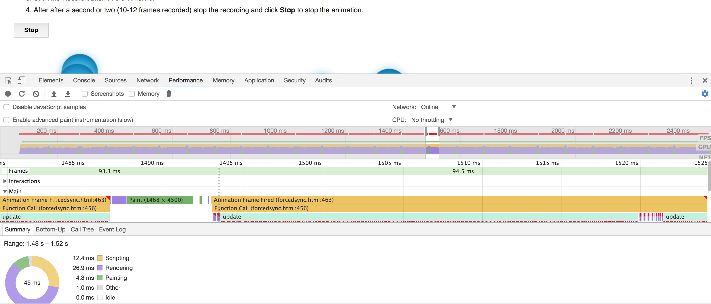
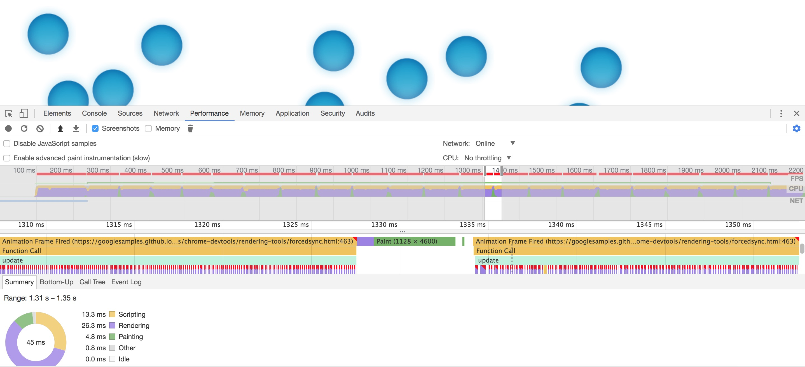
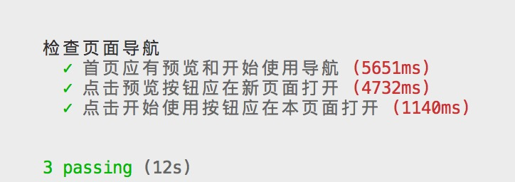
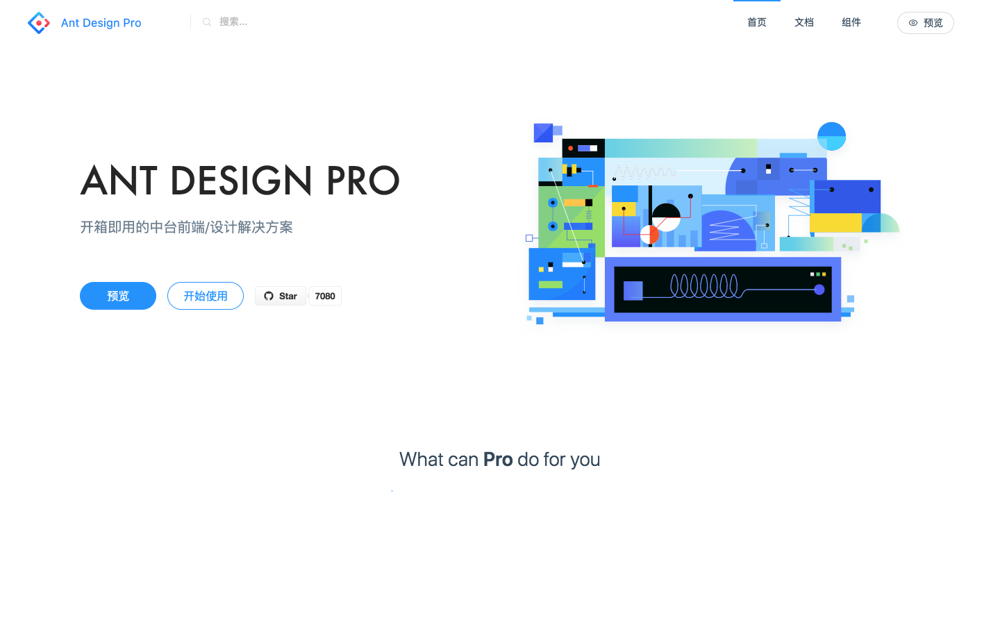
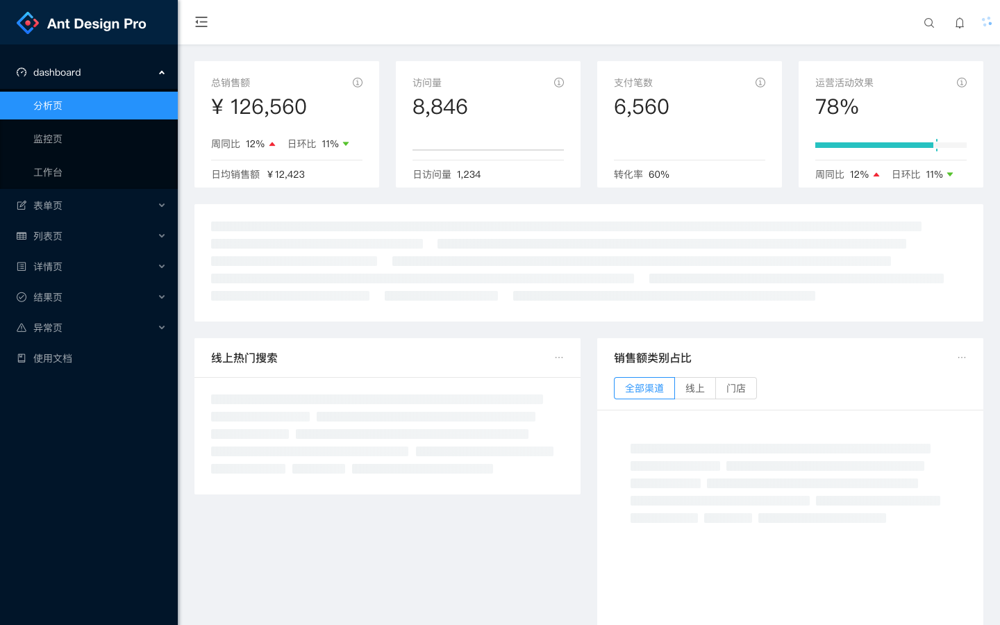
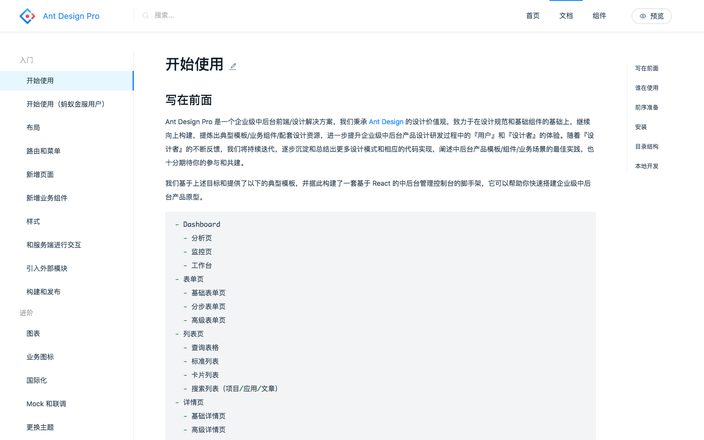

[Puppeteer](https://github.com/GoogleChrome/puppeteer)是一个Node库，通过[DevTools Protocol](https://github.com/ChromeDevTools/awesome-chrome-devtools#readme)提供高级API来控制[Headless Chrome](https://developers.google.com/web/updates/2017/04/headless-chrome)，大部分在浏览器中手动完成的事情都可以通过Puppeteer完成，以下是几个例子：

+ 打印页面：可以生成页面的screenshots和PDF
+ 高级爬虫：可以抓取SPA页面和预渲染(SSR)页面
+ 自动化测试：自动表单提交，UI测试，键盘输入等
+ 性能分析：利用chrome的timeline以帮助诊断性能问题

<!-- more -->

## 自动登录（二）
仍然以登录 https://juejin.im/ 为例，修改上次的代码，使用cookie实现自动登录。

首先来打印一张没有设置cookie时获得的屏幕截图（使用waitUntil代替page.waitFor,详细信息可见API文档）

```javascript
const puppeteer = require('puppeteer');
 
(async () => {
    const browser = await puppeteer.launch();
    let page = await browser.newPage();
    await page.setViewport({ width: 1440, height: 900 });
    await page.goto('https://juejin.im/', { waitUntil: 'networkidle2' });
    await page.screenshot({ path: '../screenshots/no-cookie.png'});
    await browser.close();
})();
```
此时得到的截图如下，为未登录界面


然后在正常浏览器的Devtools → Network中找到网站的cookie信息，需要的cookie一共有两个，名称分别为auth,auth.sig


在已登录状态下（用之前的代码），使用page.cookies()获取当前页面的cookie信息
```javascript
await page.cookies().then(res => console.log(res))
```
可以看到控制台打印出所有的cookie信息，从中找到name分别为auth和auth.sig的两个cookie


在目录下创建cookie.js，用来存放对应的cookie信息
```javascript
module.exports = {
    cookie1: {
        name: 'auth',
        value: 'eyJ0b2tlbiI6ImV5SmhZMk5sYzNOZmRHOXJaVzRpT2lKUVpXMTNWMGgzU1c5aWFEZHhVREp3SWl3aWNtVm1jbVZ6YUY5MGIydGxiaUk2SW1neVVFRXdjMmxoZDB4aU5tSlRabWtpTENKMGIydGxibDkwZVhCbElqb2liV0ZqSWl3aVpYaHdhWEpsWDJsdUlqb3lOVGt5TURBd2ZRPT0iLCJjbGllbnRJZCI6MTUxNzUzODY5MzIwNiwidXNlcklkIjoiNWE3M2M3OWNmMjY1ZGE0ZTc2MWY5YjUwIn0=',
        domain: 'juejin.im',
        path: '/',
        httpOnly: true,
        secure: true,
        session: false
    },
    cookie2: {
        name: 'auth.sig',
        value: 't9G_RRIzWnmPJONXXBs7IpwHOF0',
        domain: 'juejin.im',
        path: '/',
        httpOnly: true,
        secure: true,
        session: false
    }
};
```
现在就可以通过page.setCookie()来获取登录后的界面了
```javascript
const puppeteer = require('puppeteer');
const { cookie1, cookie2 } = require('./cookie');
 
(async () => {
    const browser = await puppeteer.launch();
    let page = await browser.newPage();
    await page.setCookie(cookie1);
    await page.setCookie(cookie2);
    await page.setViewport({ width: 1440, height: 900 })
    await page.goto('https://juejin.im/', { waitUntil: 'networkidle2' });
    await page.screenshot({ path: '../screenshots/with-cookie.png'});
    await browser.close();
})();
```
登录界面截图如下


## 性能分析
性能分析主要是使用浏览器的Devtools→Performance生成当前页面的性能追踪文件，然后就可以将其上传至Chrome来分析各种数据参数

在这里我们利用官方文档的[诊断强制同步布局](https://developers.google.com/web/tools/chrome-devtools/rendering-tools/forced-synchronous-layouts?hl=zh-cn)这个例子来对比Puppeteer操作与真实操作，可以打开[演示](https://googlesamples.github.io/web-fundamentals/tools/chrome-devtools/rendering-tools/forcedsync.html),按照点击页面上的Start按钮→点击面板上的Record按钮→点击面板上的Stop按钮的顺序获取一段性能分析，可以在Summary窗格中看到浏览器花费的时间分布



在Puppeteer通过page.tracing.start()和page.tracing.stop()来获取性能追踪数据
```javascript
const puppeteer = require('puppeteer');

(async () => {
    const browser = await puppeteer.launch();
    const page = await browser.newPage();
    await page.goto('https://googlesamples.github.io/web-fundamentals/tools/chrome-devtools/rendering-tools/forcedsync.html', { waitUntil: 'networkidle0' });
    await page.click('#toggle');
    await page.tracing.start({ path: '../data/trace/trace.json' });
    await page.waitFor(2*1000);
    await page.tracing.stop();
    await browser.close();
})();
```
在trace.json中可以看到记录的数据


最后，将trace.json通过Load profile按钮上传到chrome，可以在Summary窗格中看到两者的性能分析数据基本是一致的



感觉性能分析这块功能还很有限，期待以后有进一步完善吧

## UI自动化测试
Puppeteer/Headless Chrome非常适合做[e2e测试(Functional Tests)](https://stackoverflow.com/questions/2741832/unit-tests-vs-functional-tests)，关于前端自动化测试可以看[这篇文章](https://github.com/tmallfe/tmallfe.github.io/issues/37)

在这里我们引入mocha作为测试框架，需要全局安装mocha
```bash
$ sudo npm install -g mocha
```
简单的例子可以看[mocha-test](https://github.com/checkly/puppeteer-examples#a-mocha-tests),这里举一个访问[ant-design-pro主页](https://pro.ant.design/index-cn)的例子
```javascript
const assert = require('assert');
const puppeteer = require('puppeteer');

const PREVIEW_BUTTON = '#react-content > div > div.home-wrapper > div.banner-wrapper > div.banner-title-wrapper > div.button-wrapper > a:nth-child(1) > button';
const START_BUTTON = '#react-content > div > div.home-wrapper > div.banner-wrapper > div.banner-title-wrapper > div.button-wrapper > a:nth-child(2) > button';
let browser;
let page;

before(async () => {
    browser = await puppeteer.launch({ headless: false });
    page = await browser.newPage();
})

describe('检查页面导航', () => {
    it('首页应有预览和开始使用导航', async () => {
        await page.setViewport({ width: 1440, height: 900 });
        await page.goto('https://pro.ant.design/index-cn', { waitUntil: 'networkidle0' });
        await page.screenshot({ path: '../screenshots/welcome-page.png'});
        const PreviewButton = await page.$(PREVIEW_BUTTON);
        const StartButton = await page.$(START_BUTTON);
        assert(PreviewButton, '预期有预览按钮');
        assert(StartButton, '预期有开始使用按钮');
    }).timeout(20000);

    it('点击预览按钮应在新页面打开', async () => {
        await page.click(PREVIEW_BUTTON);
        await page.waitFor(2000); //这里是hack，如果有browser.currentPage之类的API就好了
        const pages =  await browser.pages();
        const newPage = pages[pages.length - 1];
        newPage.setViewport({ width: 1440, height: 900 });
        await newPage.waitForSelector('#root > div > div.ant-layout.ant-layout-has-sider');
        await newPage.screenshot({ path: '../screenshots/preview-page.png'});
        const sider = await newPage.$('#root > div > div.ant-layout.ant-layout-has-sider');
        assert.ok(sider);
        newPage.close();
    }).timeout(10000);

    it('点击开始使用按钮应在本页面打开', async () => {
        await page.click(START_BUTTON);
        await page.waitForSelector('#react-content > div > div.main-wrapper');
        await page.screenshot({ path: '../screenshots/start-page.png'});
        const wrapper = await page.$('#react-content > div > div.main-wrapper');
        assert.ok(wrapper);
    }).timeout(10000);
})

after(async () => {
    await browser.close()
})
```
可以看到三个测试均可成功通过



欢迎页、预览页、文档页的screenshots如下







## 参考文档
[Puppeteer API v1.0.0-post](https://github.com/GoogleChrome/puppeteer/blob/master/docs/api.md)

[Puppeteer example scripts for running Headless Chrome from Node](https://github.com/checkly/puppeteer-examples)