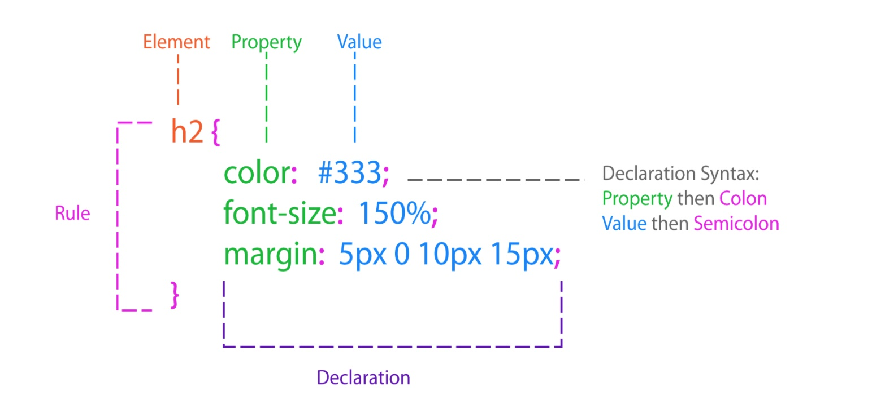

在上篇文章[从源码看postcss](https://sydot.github.io/2018/02/08/%E4%BB%8E%E6%BA%90%E7%A0%81%E7%9C%8Bpostcss/)中提到了postcss中parser的作用，即对CSS进行AST解析，这回具体探讨下解析的过程。

根据CSS规则，可将一个CSS对象解析为Element,Property,Colon,Value,Semicolon等符合CSS语法的对象



<!-- more -->

## postcss的解析

由于postcss并不是CSS执行器，不需要像浏览器那样解析CSS（具体可见[探究 CSS 解析原理](http://jartto.wang/2017/11/13/Exploring-the-principle-of-CSS-parsing/)），因而只需简单切出特殊字符以及space,brackets,string,at-word,word,comment等的代码段即可，例如上述示例代码可进行如下切分:

```css
|h2| |{|
    |color|:| |#333|;|
    |font-size|:| |150%|;|
    |margin|:| |5px| |0| |10px| |15px|;|
|}|
```

用 | 划分开的区域即为parser中的token对象，postcss在词法分析阶段（tokenize.js）将一个css文件解析为token对象组成的令牌（tokens）流，在语法分析阶段（parser.js）则将token流转换成AST形式

下面来看一下处理流程（完整源码见[官方文档](https://github.com/postcss/postcss/tree/master/lib)，已更新为es6的源码）：

首先处理'h2'，其在tokenize.js中被处理为token = ['word', 'h2',1, 1, 1, 1]，下面简单用'h2'表示，其数组成员的意义依次为：'type', 'selector', 'line', 'column', 'line', 'next-column'

```js
// this.other(token);
Parser.prototype.other = function other(start) {
    var end = false;
    var type = null;
    var colon = false;
    var bracket = null;
    var brackets = [];

    var tokens = [];
    var token = start;
    while (token) {
        type = token[0];
        tokens.push(token);

        if (type === '(' || type === '[') {
            if (!bracket) bracket = token;
            brackets.push(type === '(' ? ')' : ']');
        } else if (brackets.length === 0) { // 无brackets只需看此处循环
            if (type === ';') {
                if (colon) {
                    this.decl(tokens);
                    return;
                } else {
                    break;
                }
            } else if (type === '{') {
                this.rule(tokens);
                return;
            } else if (type === '}') {
                this.tokenizer.back(tokens.pop());
                end = true;
                break;
            } else if (type === ':') {
                colon = true;
            }
        } else if (type === brackets[brackets.length - 1]) {
            brackets.pop();
            if (brackets.length === 0) bracket = null;
        }

        token = this.tokenizer.nextToken();
    }

    if (this.tokenizer.endOfFile()) end = true;
    if (brackets.length > 0) this.unclosedBracket(bracket);

    if (end && colon) {
        while (tokens.length) {
            token = tokens[tokens.length - 1][0];
            if (token !== 'space' && token !== 'comment') break;
            this.tokenizer.back(tokens.pop());
        }
        this.decl(tokens);
        return;
    } else {
        this.unknownWord(tokens);
    }
};
```
可以看到tokens流会继续取值，直到token = ['{', '{', 1, 3]时调用this.rule(tokens)，并跳出循环
```js
Parser.prototype.rule = function rule(tokens) {
    tokens.pop(); // 去掉'{'

    var node = new _rule2.default();// node.type = 'rule'; node.nodes = [];
    this.init(node, tokens[0][2], tokens[0][3]); // 创建一个新节点node，并记录起始位置

    node.raws.between = this.spacesAndCommentsFromEnd(tokens); // node.raws.between = ' '
    this.raw(node, 'selector', tokens); // node.selector = 'h2'
    this.current = node;
};
Parser.prototype.init = function init(node, line, column) {
    // 初始 this.root.type = 'root'; this.root.nodes = []; this.current = this.root;
    this.current.push(node);

    node.source = { start: { line: line, column: column }, input: this.input };
    node.raws.before = this.spaces;// 'h2'之前的空格数
    this.spaces = ''; // 清空空格数
    if (node.type !== 'comment') this.semicolon = false;
};
```

注意到在init函数中有this.current.push(node)的写法，并不是bug，而是因为无论是root.js还是rule.js,都继承了来自container.js的原型方法如下↓
```js
Container.prototype.push = function push(child) {
    child.parent = this;
    this.nodes.push(child);
    return this;
};
```

现在我们创建了一个selector为'h2'的node节点，记录在了root.nodes当中，并令this.current指向该node节点

目前得到的AST树结构如下：
```js
this.root = {
    type: 'root',
    source: { input: this.input, start: { line: 1, column: 1 } },
    nodes: [{
        parent: this.root,
        type: 'rule',
        source: { input: this.input, start: { line: 1, column: 1 } },
        raws: { before: '', between: ' '},
        selector: 'h2',
        nodes: []
    }]
}
```
继续处理'color: #333;'，tokens流连续取值，直到token = [';', ';', 2, 16]时调用this.decl(tokens)，并跳出循环
```js
Parser.prototype.decl = function decl(tokens) {
    var node = new _declaration2.default(); // node.type = 'decl'
    this.init(node); // node.raws.before = '\n    '

    var last = tokens[tokens.length - 1];
    // 删除decl末尾的';'
    if (last[0] === ';') {
        this.semicolon = true;
        tokens.pop();
    }
    if (last[4]) {
        node.source.end = { line: last[4], column: last[5] };
    } else {
        node.source.end = { line: last[2], column: last[3] };
    }
    while (tokens[0][0] !== 'word') {
        if (tokens.length === 1) this.unknownWord(tokens);
        node.raws.before += tokens.shift()[1];
    }
    node.source.start = { line: tokens[0][2], column: tokens[0][3] };

    node.prop = '';
    // tokens = ['color', ':', ' ', '#333']
    while (tokens.length) {
        var type = tokens[0][0];
        if (type === ':' || type === 'space' || type === 'comment') {
            break;
        }
        node.prop += tokens.shift()[1]; // node.prop = 'color'
    }

    node.raws.between = '';

    var token = void 0;
    while (tokens.length) {
        token = tokens.shift();

        if (token[0] === ':') {
            node.raws.between += token[1]; // node.raws.between = ':'
            break;
        } else {
            node.raws.between += token[1];
        }
    }

    if (node.prop[0] === '_' || node.prop[0] === '*') {
        node.raws.before += node.prop[0];
        node.prop = node.prop.slice(1);
    }
    node.raws.between += this.spacesAndCommentsFromStart(tokens); // node.raws.between = ': '
    this.precheckMissedSemicolon(tokens);

    // 处理important情况，可以跳过
    for (var i = tokens.length - 1; i > 0; i--) {
        token = tokens[i];
        if (token[1].toLowerCase() === '!important') {
            node.important = true;
            var string = this.stringFrom(tokens, i);
            string = this.spacesFromEnd(tokens) + string;
            if (string !== ' !important') node.raws.important = string;
            break;
        } else if (token[1].toLowerCase() === 'important') {
            var cache = tokens.slice(0);
            var str = '';
            for (var j = i; j > 0; j--) {
                var _type = cache[j][0];
                if (str.trim().indexOf('!') === 0 && _type !== 'space') {
                    break;
                }
                str = cache.pop()[1] + str;
            }
            if (str.trim().indexOf('!') === 0) {
                node.important = true;
                node.raws.important = str;
                tokens = cache;
            }
        }

        if (token[0] !== 'space' && token[0] !== 'comment') {
            break;
        }
    }

    this.raw(node, 'value', tokens); // node.value = '#333'

    if (node.value.indexOf(':') !== -1) this.checkMissedSemicolon(tokens);
};
```
此时的AST树结构大致如下(source.end自己数的，不一定准~)：
```js
this.root = {
    type: 'root',
    source: { input: this.input, start: { line: 1, column: 1 } },
    nodes: [{
        parent: this.root,
        type: 'rule',
        source: { input: this.input, start: { line: 1, column: 1 } },
        raws: { before: '', between: ' '},
        selector: 'h2',
        nodes: [{
            parent: this.root.nodes[0],
            type: 'decl',
            source: { input: this.input, start: { line: 2, column: 5 }, end: { line: 2, column: 16} },
            raws: { before: '\n    ', between: ': '},
            prop: 'color',
            value: '#333', 
        }]
    }]
}
```

同理可以得到剩下两条声明对应的node节点，此时的AST树结构大致如下：
```js
this.root = {
    type: 'root',
    source: { input: this.input, start: { line: 1, column: 1 } },
    nodes: [{
        parent: this.root,
        type: 'rule',
        source: { input: this.input, start: { line: 1, column: 1 } },
        raws: { before: '', between: ' '},
        selector: 'h2',
        nodes: [{
            parent: this.root.nodes[0],
            type: 'decl',
            source: { input: this.input, start: { line: 2, column: 5 }, end: { line: 2, column: 16} },
            raws: { before: '\n    ', between: ': '},
            prop: 'color',
            value: '#333', 
        }, {
            parent: this.root.nodes[0],
            type: 'decl',
            source: { input: this.input, start: { line: 3, column: 5 }, end: { line: 3, column: 20} },
            raws: { before: '\n    ', between: ': '},
            prop: 'font-size',
            value: '150%', 
        }, {
            parent: this.root.nodes[0],
            type: 'decl',
            source: { input: this.input, start: { line: 4, column: 5 }, end: { line: 4, column: 28} },
            raws: { before: '\n    ', between: ': '},
            prop: 'margin',
            value: '5px 0 10px 15px',
        }]
    }]
}
```

最后处理token = ['}', '}', 5, 1]
```js
// this.end(token);
Parser.prototype.end = function end(token) {
    if (this.current.nodes && this.current.nodes.length) {
        this.current.raws.semicolon = this.semicolon;
    }
    this.semicolon = false;

    this.current.raws.after = (this.current.raws.after || '') + this.spaces;
    this.spaces = '';

    if (this.current.parent) {
        this.current.source.end = { line: token[2], column: token[3] };
        this.current = this.current.parent; // this.current = this.root
    } else {
        this.unexpectedClose(token);
    }
};
```
这样就处理完了一条css规则，并且重新将this.current指向parent节点
```js
this.root = {
    type: 'root',
    source: { input: this.input, start: { line: 1, column: 1 } },
    nodes: [{
        parent: this.root,
        type: 'rule',
        source: { input: this.input, start: { line: 1, column: 1 }, end: { line: 5, column: 1 } },
        raws: { before: '', between: ' ', semicolon: 'true', after: '\n'},
        selector: 'h2',
        nodes // 子节点
    }]
}
```
当解析完一个css文件后，this.tokenizer.endOfFile() 返回true，跳出tokens流
```js
// this.endFile()
Parser.prototype.endFile = function endFile() {
    if (this.current.parent) this.unclosedBlock();
    if (this.current.nodes && this.current.nodes.length) {
        this.current.raws.semicolon = this.semicolon;
    }
    this.current.raws.after = (this.current.raws.after || '') + this.spaces;
};
```

最终得到一个完整的AST树：

```js
this.root = {
    type: 'root',
    source: { input: this.input, start: { line: 1, column: 1 } },
    raws: { semicolon: 'true', after: ''},
    nodes // 子节点
}
```

## 总结
总结一下postcss构造的AST树中的node节点的一般规律：
+ 必然包含type, nodes, source.input, source.start属性
+ 如果有子节点，必然包含raws.semicolon, raws.after属性
+ 如果有父节点，必然包含raws.between, raws.before, parent属性
+ 如果不是'root'节点，必然包含source.end属性
+ 'rule'节点额外包含selector属性
+ 'decl'节点额外包含prop, value属性
+ 'atrule'节点额外包含name, params属性
+ 'comment'节点额外包含text属性

这个例子里面考虑的情况较为简单，没有涉及到'atrule'和'comment'等情况，也没有涉及到错误处理的情况，不过处理流程大致相同，就不多赘述了

## 参考文档
+ [AST解析基础: 如何写一个简单的html语法分析库](https://yq.aliyun.com/articles/179389)
+ [探索babel和babel插件是怎么工作的](https://yq.aliyun.com/articles/465202)